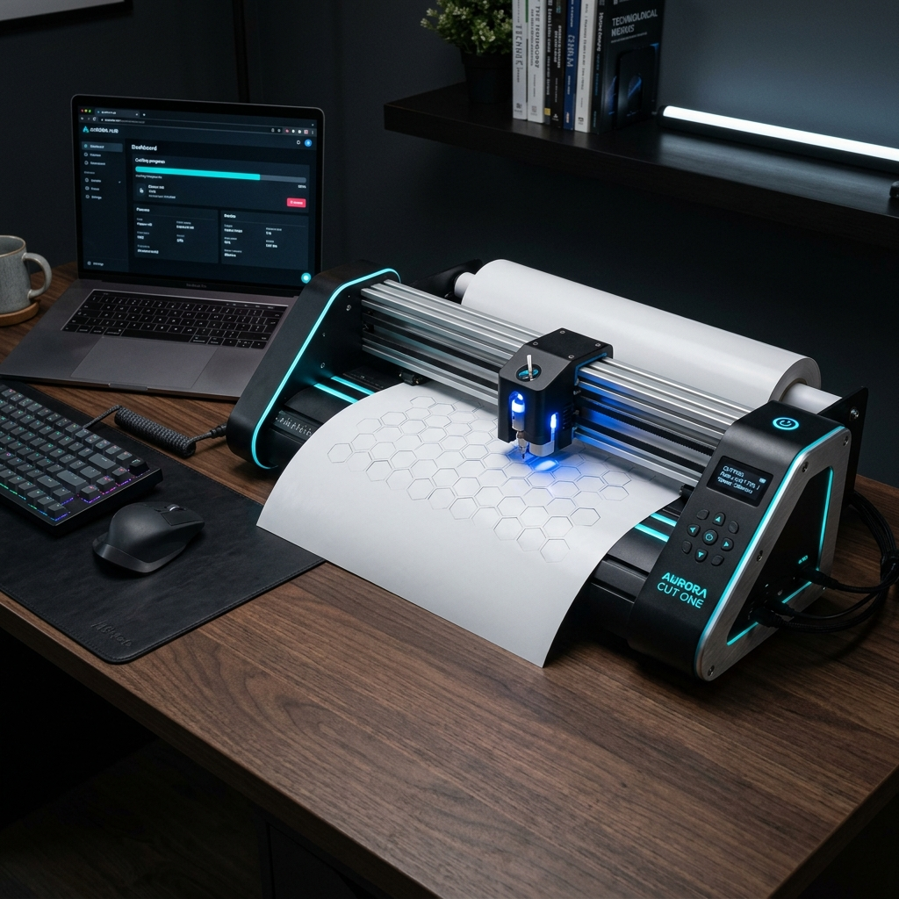

# OpenPlotter — Open-Source Precision Cutting Plotter System



OpenPlotter is a production-grade, open-source cutting plotter platform. It provides high-performance C++ firmware that runs across multiple microcontroller architectures (Arduino Mega 2560, Arduino Nano, ESP32) and a sleek, native Web/Desktop Companion application for design, manual jogging, calibration, and real-time cutting control.

---

## Documentation

The documentation has been completely overhauled and split into dedicated guides:

- **[Setup Guide](docs/SETUP_GUIDE.md)**: Instructions for installing the Companion App and flashing the firmware.
- **[Wiring Guide](docs/WIRING_GUIDE.md)**: Hardware wiring schematics and instructions for RAMPS 1.4 and CNC Shield V3.
- **[G-Code Reference](docs/GCODE_REFERENCE.md)**: Comprehensive list of supported G-codes, M-codes, and System Commands.
- **[Troubleshooting](docs/TROUBLESHOOTING.md)**: Common issues, alarm locks, and compilation errors.

---

## Features

### 1. High-Performance Companion App
- **Clean Native Theme**: A sleek, professional dark mode interface inspired by VSCode and GitHub, delivering premium performance and aesthetics.
- **Flash Orchestrator**: Automatically downloads required Arduino libraries, compiles the C++ firmware, and flashes it directly to your board using `arduino-cli`—all from within the UI.
- **SVG Path Importer & Optimizer**: Automatic curve linearization (Bézier curves to polylines), scaling, centering, and canvas previews.
- **Interactive Design Bed Canvas**: Interactive pan, zoom, scale, and offset controls showing real-time machine crosshair tracking.
- **Live Console & Log Panel**: A dedicated terminal for direct G-code entry and advanced system monitoring.

### 2. Robust Multi-Platform Firmware
- **Hardware Abstraction Layer (HAL)**: Uniform codebase compiling natively for AVR ATmega (Mega/Nano) and ESP32 architectures.
- **Trapezoidal Look-Ahead Planner**: Advanced trajectory calculations to allow smooth, high-speed cornering without full stops.
- **Timer-Interrupt Stepper Engine**: High-frequency, jitter-free stepper pulse timing utilizing hardware timers.
- **Dual Homing Modes**:
    - **Sensored Homing**: Mechanical endstops (Normally Closed / Normally Open).
    - **Sensorless Homing**: Integrated TMC2209 StallGuard torque sensor monitoring for crash-less, switch-free homing.
- **Modular Tools**: Built-in support for servo-controlled pens (pen plotters), solenoid-actuated drag knives, and tangential rotating knives.

---

## Quick Start

See the [Setup Guide](docs/SETUP_GUIDE.md) for full instructions.

### 1. Run the Companion App

Make sure [Node.js](https://nodejs.org/) is installed, then open a terminal in the `app/` folder:
```bash
npm install
npm run electron:start
```

### 2. Configure and Flash
1. Connect your board via USB.
2. In the App, configure your machine dimensions and drivers under the **Plotter Config** tab.
3. Scroll down to the **Flash Firmware** section, select your COM port, and click **Compile & Flash**.
