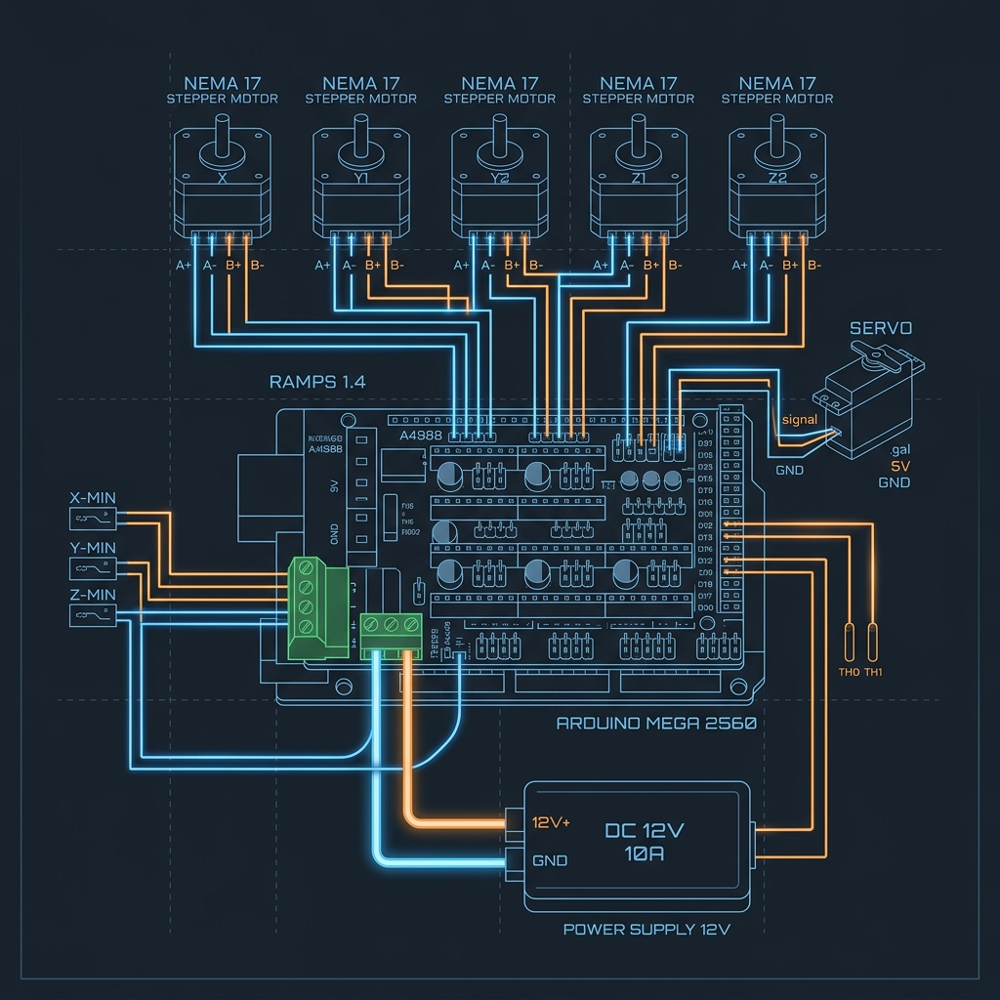

# OpenPlotter v4.0 Wiring Guide

This guide covers wiring the electronic components for your OpenPlotter. It supports modern 32-bit boards (BTT SKR Mini E3, MKS Gen L), ESP32 Hybrid setups, and legacy 8-bit boards.

## 1. General Stepper Motor Wiring

NEMA 17 stepper motors generally come with 4 wires. You must pair the wires into their respective coils (A and B). 
- If you don't know the pairs, cross two wires and turn the shaft by hand. If it offers resistance, those two wires belong to the same coil.
- Typical colors: **Black/Green** (Coil A) and **Red/Blue** (Coil B).

> [!CAUTION]
> **NEVER unplug or plug in a stepper motor while the board is powered.** Doing so will instantly destroy the stepper driver chip.

## 2. Advanced Driver Configuration (TMC UART / SPI)

Modern setups use TMC drivers in "smart" modes. This allows the OpenPlotter companion app to configure motor currents (VREF) digitally, eliminating the need to tune potentiometers with a multimeter.

### TMC2208 / TMC2209 (UART)
- **Wiring:** If using a board with native UART routing (like BTT SKR), simply insert the driver and the appropriate jumpers underneath (refer to your board's manual). 
- **Standalone/RAMPS:** You must solder a wire from the driver's UART pin (usually TX/RX tied together) to a designated AUX pin on the RAMPS shield, and configure `TMC_X_ADDR` in `openplotter_config.h`.
- **Sensorless Homing:** (TMC2209 only). Wire the `DIAG` pin of the driver to the Endstop signal pin to eliminate physical limit switches.

### TMC2130 / TMC5160 (SPI)
- **Wiring:** Requires 4 wires (MOSI, MISO, SCK, CS) connected from the driver to the SPI header on your board. 
- **CS Pins:** Ensure `X_CS_PIN`, `Y_CS_PIN` are correctly mapped in your config.

## 3. Power Supply (360W 24V/12V Industrial PSU)

High-speed plotting requires stable power. A 360W (15A/24V or 30A/12V) industrial power supply is recommended.

> [!WARNING]
> **Mains Voltage (110V/220V) is lethal.** Ensure the PSU is disconnected from the wall before wiring. Use proper crimped spade connectors for all screw terminals.

- **Grounding:** Connect the Earth/Ground wire from your mains plug to the grounding terminal (`⏚`) on the PSU.
- **Load Balancing:** When connecting to a board (e.g., RAMPS 1.4) that has multiple input banks (e.g., 5A and 11A terminals), split the positive (`V+`) and negative (`V-`) rails from the PSU to feed BOTH inputs to prevent overloading a single terminal block.

## 4. Modern 32-bit Boards (BTT SKR, MKS)

- **Power:** Connect the PSU `V+` and `V-` to the `DC IN` terminals.
- **Drivers:** These boards support UART/SPI natively. Populate the jumpers according to the manufacturer's manual for UART mode.
- **Endstops:** Connect switches to `X-STOP` and `Y-STOP`.

## 5. ESP32 Hybrid Mode (Wireless Streaming)

If you are using an Arduino Mega/Nano for motion control, but want wireless capabilities:
- Wire the ESP32 `TX` pin to the Arduino `RX` pin (Serial1 on Mega, or SoftwareSerial on Nano).
- Wire the ESP32 `RX` pin to the Arduino `TX` pin.
- Ensure the GNDs are tied together.
- Flash the `BOARD_MEGA_ESP32_HYBRID` or `BOARD_NANO_ESP32_HYBRID` firmware to the Arduino, and the `BOARD_ESP32` bridge firmware to the ESP32.

## 6. Endstops & Limit Switches
Limit switches are used for Homing (`$H`).
- Use the **C (Common)** and **NC (Normally Closed)** pins on the microswitch for better noise immunity.
- Connect to the `S` (Signal) and `-` (Ground) pins. **Do NOT connect to `+` (5V)**.

## 7. Servo Motor (Pen Lift)

If you are using a standard RC Servo (like an SG90) to lift the pen:
- Connect the Signal wire (usually yellow/orange) to the designated Servo pin (e.g., Pin 11 on RAMPS).
- Connect 5V (Red) and GND (Brown/Black). Ensure the board provides adequate 5V current for the servo; otherwise, use a separate 5V regulator (BEC).
